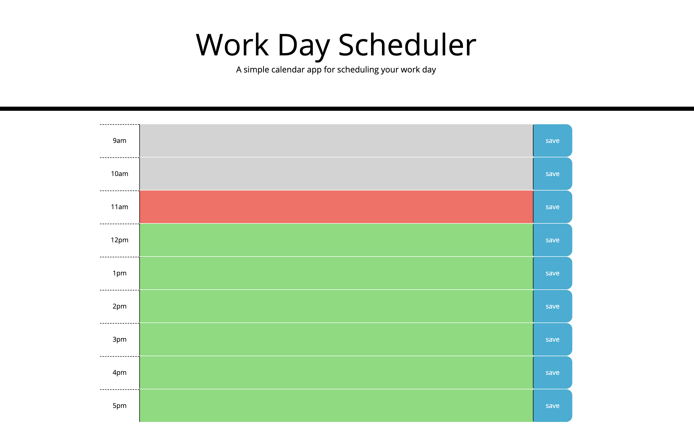

# Work Day Scheduler

## What is the purpose of this project? 
The purpose of this project is to create simple calendar application that allows a user to save events for each hour of the day. This app will run in the browser and feature dynamically updated HTML and CSS powered by jQuery.

## How to achieve my goal?
First of all, I created **time blocks** (from 9am to 5pm) in the html file. Then I established localStorage to **save** the entered data (meeting or other event information) along with the time. By utilizing the [Moment.js] to determine the current hour, the time blocks are color coded differently based on the classes dynamically added to the past hours, current hour, and the future hours.

## Challenges
I am not sure why sometimes the classes that were dynamically added to the script file would be malfunctioned. It also took me a while to identify the parent and siblings from the html file that are associated with the button-click event.

## Credits

The initial codes are provided by Trilogy Education Services, a 2U, Inc. brand.

## License

© Irene Asay. All Rights Reserved. Under the [MIT/](./license.txt) license.
